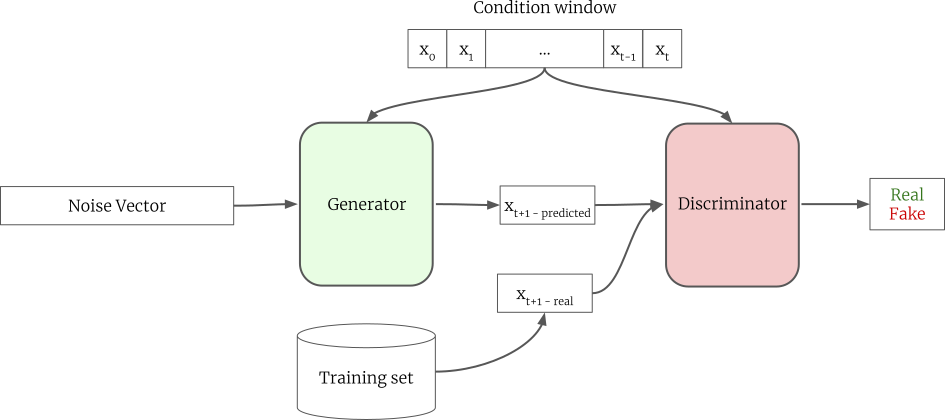
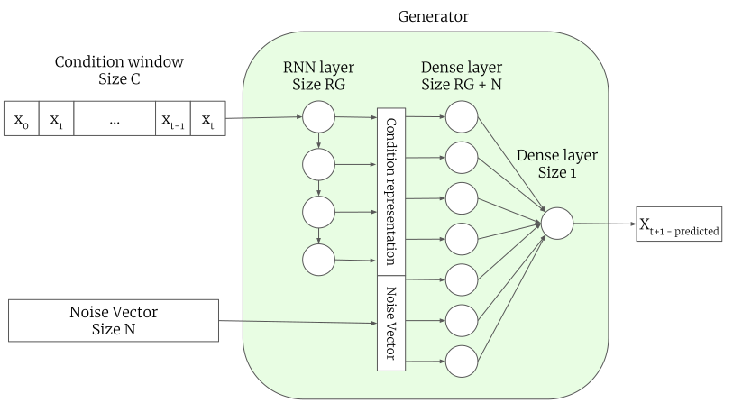
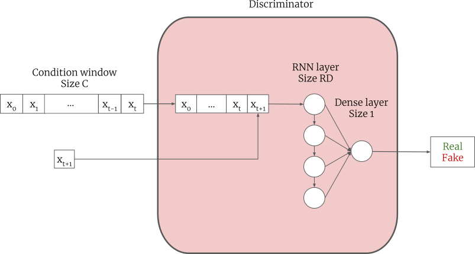

# ForGAN
Pytorch implementation of "[Probabilistic Forecasting of Sensory Data with Generative Adversarial Networks - ForGAN](https://ieeexplore.ieee.org/abstract/document/8717640)"

ForGAN is one step ahead probabilistic forecasting model. It utilizes the power of the conditional generative adversarial network to learn the probability distribution of future values given the previous values. The following figure presents ForGAN architecture.







We tested ForGAN against two publicly available datasets, namely Mackey-Glass dataset and Internet traffic dataset (A5M), and a new dataset, Lorenz dataset. The impressive performance of ForGAN demonstrates its high capability in forecasting future values.

## G-Regression
We take the structure of the generator and build a deterministic model based on that. For doing so, we removed the noise vector and trained it using MAE as the loss function. We called this network G-Regression. We used G-Regression as one of our baselines.

## Lorenz dataset
To closely observe the performance of our method we need extra information about the probability distribution of the generative process. Therefore, we created a toy dataset called the Lorenz dataset. The dataset contains 100000 time-series with length 24. The data has 5 modes and it is obtained using the Lorenz equation with 5 different seed values. The process of generating the dataset is described in the paper with full details. The animation below demonstrates ForGAN performance during training. It is learning the 5 modes of the Lorenz dataset alongside the probability distribution of the entire dataset.


In this video, the green line is the discriminator's decision boundary. Orange distribution is the data distribution and blue distribution is ForGAN's generator learned distribution

## Mackey-Glass dataset
The time delay differential equation suggested by Mackey and Glass has been used widely as a standard benchmark model to generate chaotic time-series for the forecasting task.

## Internet Traffic dataset (A5M)
Internet Traffic dataset belongs to a private ISP with centers in eleven European cities (which is commonly known as A5M). It contains data corresponding to a transatlantic link and was collected in 2005 from 06:57 on 7th of June to 11:17 on 29th of July.

## Metric and results
In the paper, we reported the performance of ForGAN and other models using RMSE, MAE, MAPE, and KLD. However, we observed that each of these metrics has its shortcoming and are not suitable for our task. You can find the full discussion in the paper. In this implementation, we report the performance of our model in "continuous ranked probability score (CRPS)". CRPS is a metric for reporting the performance of the probabilistic forecasting method. 
```math
CRPS^*(F,x) = E_{F}|X-x| - \frac{1}{2}E_{F}|X-X'|
```
where X and X' are independent copies of a random variable from probabilistic forecaster F and x is the ground truth.
CRPS is comparable to the MAE of the deterministic model. As a result, the direct comparison of a probabilistic model with a deterministic model becomes possible. For full discussion please refer to [[1]](#1)

## Results
By running the code the following CRPS should be obtained.

|  | G-Regression (MAE) | ForGAN (CRPS) |
| ------ | ------ | ------ |
| Lorenz dataset | $`2.39`$ | $`1.511`$ |
| Mackey-Glass dataset | $`4.92 \times 10^-4`$ | $`1.91 \times 10^-4`$ |
| Internet Traffic dataset | $`9.01 \times 10^7`$ | $`6.84 \times 10^7`$ |

You can find further results and discussion in the paper.

## How to run
For each experiment, there is a shell script that runs the experiment on that dataset with the best hyperparameters. One can easily run ForGAN with different hyperparameters by editing the shell script file. The best performing model in the validation set is saved in a folder with the same name as the dataset. One can load this model later for further inspection and inference.

## Environment
Python = 3.6.8
Pytorch = 1.0.1

## Acknowledgement
This work has been conducted in FLaP lab. FLaP is a joint lab between IAV GmbH and DFKI GmbH. IAV is a leading engineering company in the automotive industry, designing products for powertrain, electronics, and vehicle development. DFKI is the german research center for artificial intelligence which is one of the leading AI research centers in Germany.

## References
<a id="1">[1]</a> 
Gneiting, Tilmann, and Adrian E. Raftery. "Strictly proper scoring rules, prediction, and estimation." Journal of the American statistical Association 102.477 (2007): 359-378.